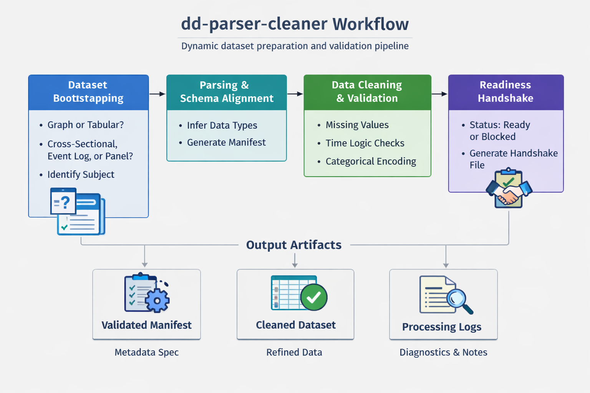

# dd-parser-cleaner

**One-line summary**  
`dd-parser-cleaner` inspects incoming datasets, emits validated manifests describing structure and modalities, runs deterministic integrity checks, and writes a handshake file that downstream featurizers must read before transforming data.

## Purpose

This package provides discovery and validation for enterprise datasets. It detects dataset type (cross-sectional, event-log, panel, homogeneous/bipartite/heterogeneous graph), tags attributes with roles and modalities, validates keys and joins, and produces actionable diagnostics and remediation hints. The canonical outputs are **dataset manifest**, **attribute manifest**, and **handshake.json**.



## Quick start (workflow)

1. **Initialize the workspace**

```bash
init-workspace .
```

2. **Optionally verify file placement**

```bash
location-helper .
```

3. **Bootstrap dataset metadata**

```bash
dataset-bootstrap .
```

This writes `bootstrap_metadata.yaml` and captures dataset type, subject metadata, and optional use-case answers.

- Supports **tabular datasets** and **homogeneous graphs learnable from tabular data**.
- Other graph types (bipartite/heterogeneous graphs) are not supported in this version and are explicitly marked out of scope during bootstrapping.
- Run `bootstrap-config --output config.yaml .` next so the bootstrap answers are propagated into `config.yaml` for parser, cleaner, and notebook metadata flows.

4. **Generate runtime config**

```bash
bootstrap-config --output config.yaml .
```

This consumes `bootstrap_metadata.yaml`, discovers data and dictionary files, and writes `config.yaml`.

5. **Run the parser**

```bash
classify-entities --config config.yaml
```

This produces parser artifacts such as:

- `documents/dd_analysis_results/<dataset_id>_analysis_results.csv`
- `documents/dd_analysis_results/<dataset_id>_dataset_manifest.json`
- `documents/dd_analysis_results/<dataset_id>_attribute_manifest.json`
- `documents/dd_cleaner/<dataset_id>_parser_cleaner_handshake.md`

6. **Run the cleaner**

```bash
clean-dataset --config config.yaml --action full
```

This validates the manifests, produces diagnostics, and exports the synchronized dataset to:

- `data/dd_cleaner/<dataset_id>_clean.csv`

7. **Featurizer** must read the generated handshake file and proceed only if `status == "ready"`.

## Notebook examples

The repository includes example notebooks under `tests/notebooks/`, including a notebook that demonstrates notebook API usage for metadata bootstrap and dataset metadata exposure:

- `tests/notebooks/metadata_bootstrap_example.ipynb`

## Key capabilities

- **Dataset discovery**: auto-detects `dataset_type` and primary/time keys.
- **Attribute tagging**: emits `role`, `time_dependency`, `granularity`, `modality`, `suggested_checks`, `generated_key_flag`.
- **Graph support**: homogeneous, bipartite, heterogeneous graphs with entity/relationship maps.
- **Longitudinal support**: event-log vs panel; static vs dynamic attributes.
- **Manifest emission**: canonical JSON manifests for downstream deterministic featurization.
- **Cleaner validations**: monotonicity, lag consistency, cycle detection, relation consistency, URL/geo sanity checks.
- **Handshake contract**: `handshake.json` with `status` (`ready` | `blocked` | `warnings`).
- **Config driven**: behavior controlled by `config.yaml` flags.

## Example artifacts

### Example dataset manifest (snippet)

```json
{
  "dataset_id": "orders_2026",
  "dataset_type": "event_log",
  "primary_key_spec": ["order_id"],
  "time_key_spec": "event_time",
  "entity_files": [],
  "relation_files": [],
  "panel_variable_map": null,
  "notes": "Order events from e-commerce pipeline",
  "validation_errors": []
}
```

### Example attribute manifest entry

```json
{
  "attribute_name": "order_id",
  "role": "subject_key",
  "time_dependency": "none",
  "granularity": null,
  "modality": "categorical",
  "suggested_checks": ["null_profile"],
  "generated_key_flag": false
}
```

### Example handshake.json

```json
{
  "status": "ready",
  "manifest_path": "manifests/orders_2026.json",
  "blocking_reasons": []
}
```

## Where to find schemas and examples

- **JSON Schema files** (manifest validation): `schemas/dataset_manifest.json`, `schemas/attribute_manifest.json`, `schemas/handshake.json`
- **Workspace questionnaire config**: `documents/config/dataset_questions.json`
- **Sample manifests and fixtures**: `tests/fixtures/manifests/` and `tests/fixtures/csvs/`
- **Regression coverage**: `tests/test_sba_end_to_end.py`, `tests/test_mn_traffic_end_to_end.py`, and `tests/test_itsm_end_to_end.py`
- **Docs and design**: `USER_GUIDE.md`, `documents/`, and `docs/manifest.md`

## Important config flags (defaults)

Add or review these in `config.yaml` under a `manifest` section:

```yaml
manifest:
  require_manifest_before_featurize: true
  use_case_questions_enabled: false
  graph_entity_limit: 5
  generate_surrogate_keys: true
  url_sample_size: 10
```

## Handshake contract (featurizer requirements)

- Featurizer **must** read `manifests/handshake.json` before any transformation.
- If `status == "blocked"`, the featurizer must refuse to proceed.
- If `status == "warnings"`, the featurizer may proceed only after acknowledging and recording the warnings.
- Handshake metadata now includes bootstrapped dataset context for downstream assistants.

Required handshake metadata fields:

- `dataset_type`: dataset taxonomy from bootstrap.
- `subject`: dataset subject, or `Not applicable` when missing.
- `subject_id_attribute`: subject key name, or `Not applicable` for cross-sectional datasets.
- `wide_short_homogeneous`: boolean signal for wide-short grouping.
- `wide_short_representative_column`: representative column name, or `Not applicable` when not applicable.

## Migration and compatibility

- New manifest fields are **additive** and optional. Existing cross-sectional outputs remain unchanged during phased rollout.
- Recommended phased rollout:

1. Emit manifests and handshake while preserving legacy outputs.
2. Enable cleaner validators and handshake enforcement behind config flags.
3. Deprecate legacy outputs after one release cycle.

## Troubleshooting (common validation failures)

- **Missing primary key**: parser will generate a surrogate key and set `generated_key_flag`; prefer providing explicit keys.
- **Time key absent for longitudinal data**: set `time_key_spec` or mark dataset as `cross_sectional`.
- **Relation file join mismatch**: ensure `entity_key_spec` matches keys referenced in relation files.
- **Heterogeneous graph cycle detected**: convert to acyclic tree or correct relationship files.
- **Invalid URLs or geo addresses**: check `modality` tags and sample rows flagged in diagnostics.

Each validation error includes `severity`, `remediation`, and `sample_rows` in the cleaner report.

## How clients and agents should use `get_package_info()`

Use `get_package_info()` to discover:

- CLI commands and entry points
- `manifest_schema_paths` for validation
- `handshake_spec` and allowed `status` values
- `supported_dataset_types` and important `config_flags`

Treat `get_package_info()` as the canonical programmatic discovery endpoint.

## Support and contribution

- **Issue tracker**: add issues at the repository issue tracker (link in `get_package_info()` output).
- **Contributing**: follow repository CONTRIBUTING.md for tests, fixtures, and schema updates.
- **Contact**: open an issue for integration questions or schema clarifications.

## One-line blurb for top-level README

`dd-parser-cleaner` inspects datasets, emits validated manifests and a handshake file describing keys, time semantics, modalities, and graph structure, and provides deterministic diagnostics so downstream featurizers can safely and reproducibly transform data.

## Existing quick links

- `USER_GUIDE.md` for usage details
- `documents/` for methodology and internal design notes
- `tests/notebooks/` for example notebook workflows
